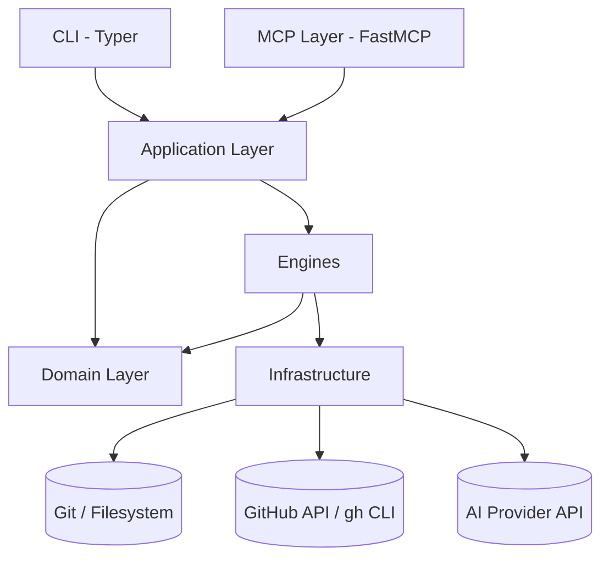
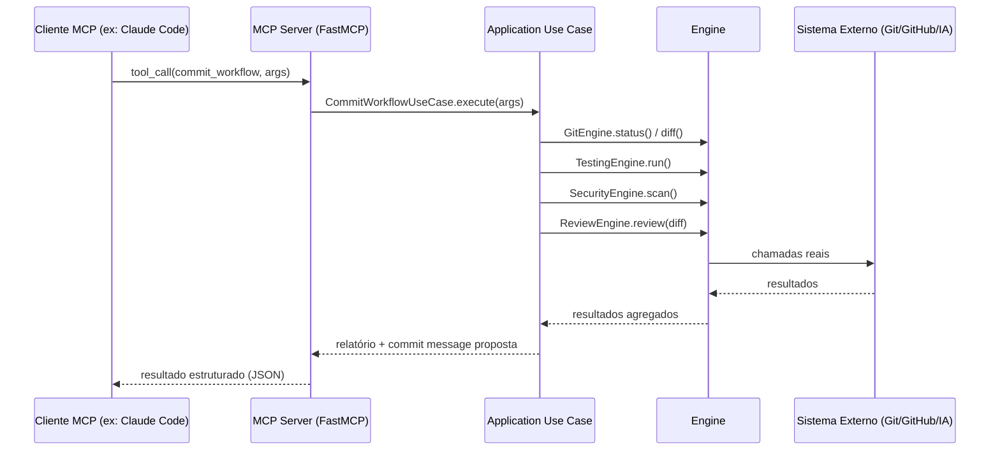
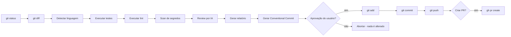
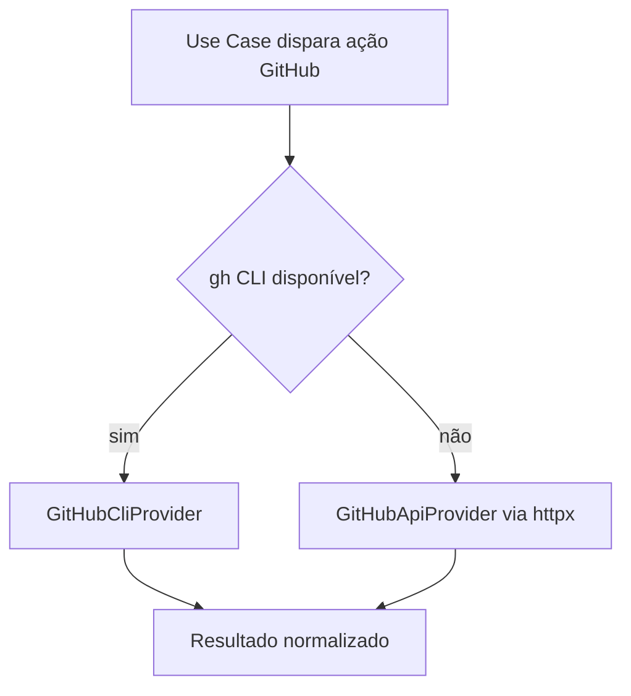
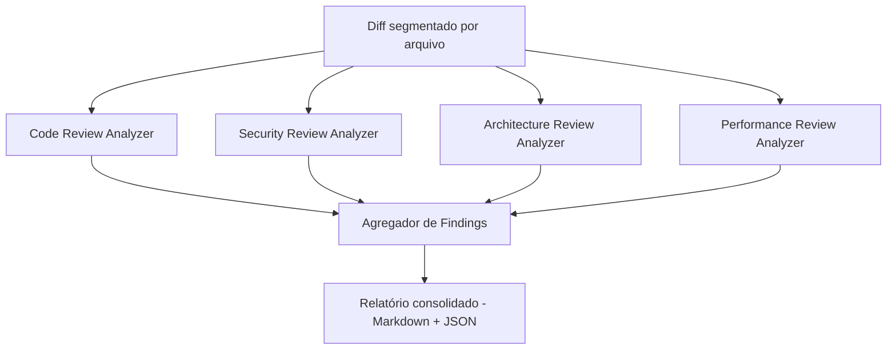

# ARCHITECTURE.md

## 1. Visão Geral

`git-ai-agent` segue **Clean Architecture** com elementos de **DDD** (Domain-Driven Design) leve, organizados em camadas concêntricas. Dependências sempre apontam para dentro (em direção ao `domain`).



## 2. Camadas

### Domain
Entidades e regras de negócio puras, sem I/O: `Commit`, `Diff`, `ReviewFinding`, `Severity`, `ReleasePlan`. Define também as **interfaces** (Protocols) que `infrastructure` e `engines` implementam — ex.: `GitRepository`, `AIReviewer`, `GitHostProvider`.

### Application
Casos de uso que orquestram o domínio: `CommitWorkflowUseCase`, `ReviewPullRequestUseCase`, `GenerateChangelogUseCase`, `CreateReleaseUseCase`. Não conhece detalhes de Git real, GitHub real ou IA real — depende apenas das interfaces do `domain`.

### Infrastructure
Implementações concretas das interfaces: `GitPythonRepository`, `GitHubCliProvider`, `GitHubApiProvider` (fallback httpx), `AnthropicReviewer`.

### Engines
Coordenadores especializados, construídos sobre `infrastructure`, que encapsulam lógica específica de domínio técnico:
- `git_engine` — operações Git de baixo nível.
- `github_engine` — PRs, releases, issues.
- `review_engine` — orquestra os 4 analisadores (code/security/architecture/performance).
- `security_engine` — scanners de segredo (regex + entropia) e SAST leve.
- `testing_engine` — detecção de linguagem e execução de test runners/lint apropriados.

### MCP Layer
Cada caso de uso é exposto como uma `@mcp.tool()` em `mcp/tools/`. A camada MCP é fina: valida input (Pydantic), chama o `application`, formata output.

### CLI
Interface Typer espelhando 1:1 as tools MCP, para uso humano direto no terminal, com saída rica via `Rich`.

## 3. Fluxo MCP



## 4. Fluxo Git (pipeline de commit)



## 5. Fluxo GitHub



## 6. Fluxo de Revisão por IA



## 7. Decisões Arquiteturais e Motivação

| Decisão | Motivação | Trade-off |
|---|---|---|
| Clean Architecture com Domain isolado | Permite testar regras de negócio sem Git/GitHub/IA reais | Mais boilerplate inicial (interfaces) |
| FastMCP para camada MCP | Padrão emergente, integra nativamente com Claude Code e clientes MCP | Acoplamento a uma lib em evolução — mitigado por camada fina |
| `gh` CLI como integração primária com GitHub | Reaproveita autenticação já configurada do usuário, menor superfície de gerenciamento de tokens | Exige `gh` instalado — fallback via API cobre CI |
| Engines paralelas para review | Reduz latência total do pipeline | Maior complexidade de agregação de erros parciais |
| Pydantic v2 para toda fronteira de dados | Validação forte, serialização consistente para MCP | Custo de aprendizado para contribuidores novos — mitigado com exemplos em docs |

Toda nova decisão estrutural relevante deve ser registrada em `DECISIONS.md` e referenciada aqui.

## 8. Estrutura de Pastas (visão completa)

```
git-ai-agent/
├── src/git_ai_agent/
│   ├── domain/
│   ├── application/
│   ├── infrastructure/
│   ├── engines/
│   │   ├── git_engine/
│   │   ├── github_engine/
│   │   ├── review_engine/
│   │   ├── security_engine/
│   │   └── testing_engine/
│   ├── mcp/
│   │   ├── server.py
│   │   └── tools/
│   ├── cli/
│   ├── config/
│   └── logging/
├── tests/
│   ├── unit/
│   └── integration/
├── docs/
├── examples/
├── .github/workflows/
├── .devcontainer/
├── .claude/
└── config/
```
